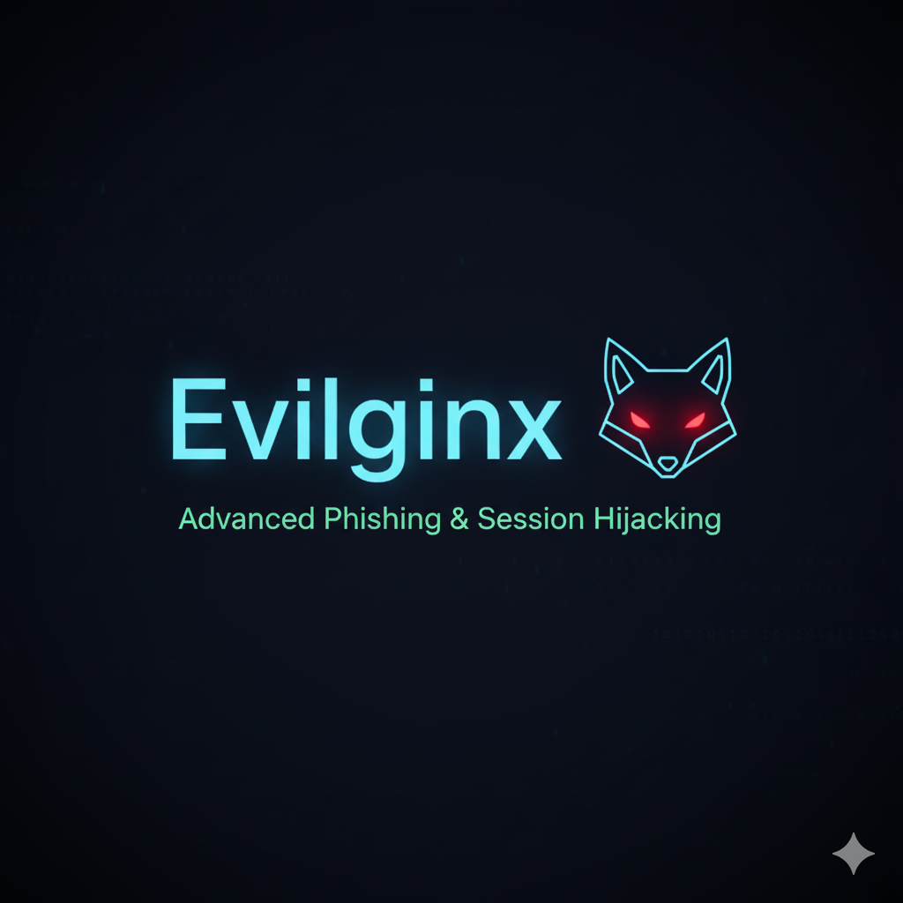

# 🎣 Campaña de Phishing en Entorno Controlado (Evilginx)

## 📄 Introducción

Este repositorio contiene la documentación y los pasos detallados de una **simulación de campaña de phishing** llevada a cabo en un **entorno de laboratorio controlado**.

El proyecto utiliza la herramienta de phishing de red social avanzada **Evilginx** y tiene un doble propósito:
1.  Analizar de forma práctica las técnicas de **captura de sesiones de usuario** (session hijacking).
2.  Evaluar la efectividad de los controles de seguridad en un entorno autorizado.

> **🚨 Nota Importante:** Todo el proceso descrito es con **fines estrictamente educativos e informativos**. El autor no se hace responsable del uso malintencionado de la información.

---

## 🛠️ Prerrequisitos

Para replicar el laboratorio y ejecutar la herramienta, es necesario tener instalados y configurados los siguientes componentes:

* **Go (Golang):** Necesario para compilar y ejecutar Evilginx.
    * [Instalación de Go](https://go.dev/doc/install)
* **Git:** Necesario para clonar el repositorio de Evilginx2 y las plantillas (phishlets).
    * [Instalación de Git](https://git-scm.com/downloads)
